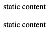

# cy-giraffe

Extends the standard set of commands in [Cypress](https://cypress.io)

## Installation

```shell
npm install cy-giraffe
```

In your cypress/support/commands.js file, add the following:

```javascript
require('cy-giraffe')
```

## Command List

- [log](#log)
- [hide](#hide)
- [innerText](#innertext)

### log

Changes camelCase to snake_case in the second argument of the `log` command.

Example:

```javascript
cy
  .log('open file', {fileName: 'main.json'})
```

Before use cy-giraffe


After use cy-giraffe


### hide

Hide element.  
It is used when you need to hide dynamic content before taking a screenshot.

Example:

```html

<div class="static">static content</div>
<div class="dynamic">dynamic content</div>
<div class="static">static content</div>
```

```javascript
cy
  .get('div[class="dynamic"]')
  .should('be.visible')
  .hide()
  .should('not.be.visible')
```

Before use cy-giraffe


After use cy-giraffe



### innerText

Get .innerText from element. Standard `.should('have.text')` returns .textContent. Read more:

- [https://dev.to/tit/innertext-vs-textcontent-in-cypress-53jh](https://dev.to/tit/innertext-vs-textcontent-in-cypress-53jh)
- [https://www.kellegous.com/j/2013/02/27/innertext-vs-textcontent/](https://www.kellegous.com/j/2013/02/27/innertext-vs-textcontent/)
- [https://betterprogramming.pub/whats-best-innertext-vs-innerhtml-vs-textcontent-903ebc43a3fc](https://betterprogramming.pub/whats-best-innertext-vs-innerhtml-vs-textcontent-903ebc43a3fc)

Example:

```html

<span class="fullName">Homer <span style="display: none;">J. </span>Simpson</span>
```

```javascript
cy
  .get('span[class="fullName"]')
  .should('have.text', 'Homer J. Simpson')
  .innerText()
  .should('eq', 'Homer Simpson')
```

